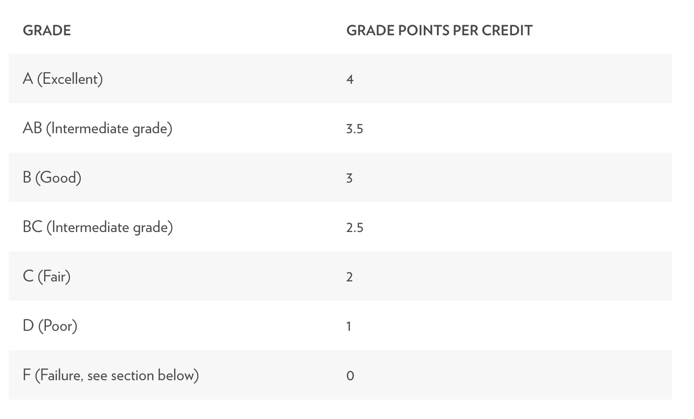

# College evaluation project:

We are ShareCrabb consulting, a fictitious firm hired by the world famous (fictitious) Chris Jenkins foundation.
Jenkins has entrusted us with choosing a college to recieve his enormous yearly donation.

## Core evaluation metric:

 Our evaluation metric will be the school's grade-points-per-credit system  

## Conditions:
<ol>
	<li>STEM education:
	Jenkins wants a school that has STEM courses that are on par or better than courses in the humanities</li>
	<li>STEM progression:
	Jenkins is concerned with the future of education, especially in STEM courses. We are looking for a school that has shown improvement in their STEM departents during recent years</li>
	<li>Class duration:
	Jenkins is interested in the effect of time spent in class. Do Classes with longer sessions produce better grades?</li>
	<li>Class size:
	Jenkins is concerned about the effects of large class sizes on the individual student's education. </li>
</ol>

### The ShareCrabb gameplan:
<ol>
	<li>We will build a psql database to house the school's information.</li>
	<li>We will query the database to find information relating to Jenkins's criteria</li>
	<li>We will perform hypothesis testing to evaluate the significange of the school in relation to our criteria</li>
	<li>We will give a final recommendation</li>
</ol>

